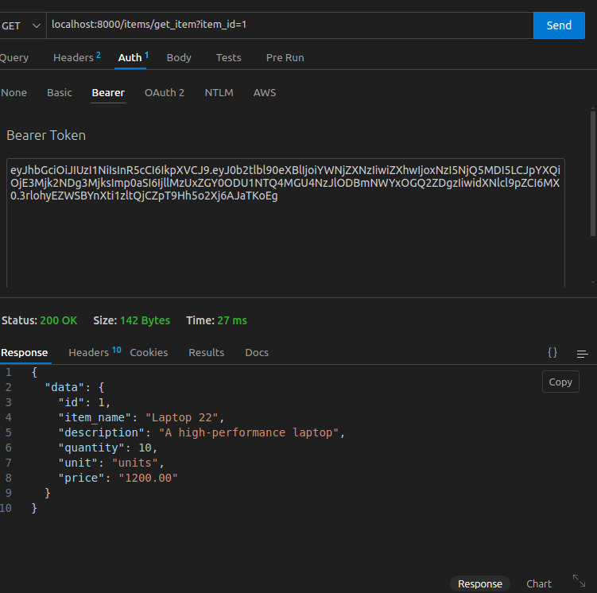

# IMS (Inventory management System)

## Pre-requisites
- Python version 3.10
- Docker installed

## Setting up project 
- <code>docker compose build</code> &nbsp; // the project is pulled to docker container, other services such redis and postgres are also activated.
- <code>docker compose up -d</code> &nbsp; //command run the project in container in daemon mode.
- <code>docker exec 'container-name' python manage.py makemigrations</code>
- <code>docker  exec 'container-name' python manage.py migrate</code>
- <code>docker exec 'container-name' python manage.py test</code>
- For api testing, Install https://www.thunderclient.com/ and import the collection <code>thunder-collection_ims.json</code>

## Running the project
- Whole project is divided two apps User, and inventory.
- User app manages the register and login of user. Once the user is logged in, api responses with refresh and access token.
- add the access token authorization header of api requests for inventory related details like item creation, edit, view delete.
- The following is an example, how the api request is done through thunder client

The following image is the get api for th accessing single item (item_id=7)

Since the API authenticated, API's will not be able to access

So the User need to login and get the access as shown in below.

put that access token to the under Auth bearer token and response success response with 200.

similarly, the same thing should be followed with other APIs, other then Register and Login which public accessible.